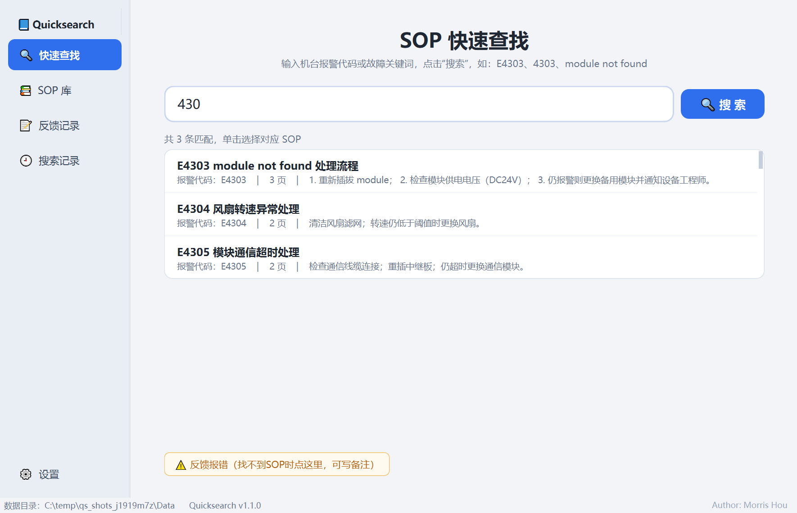
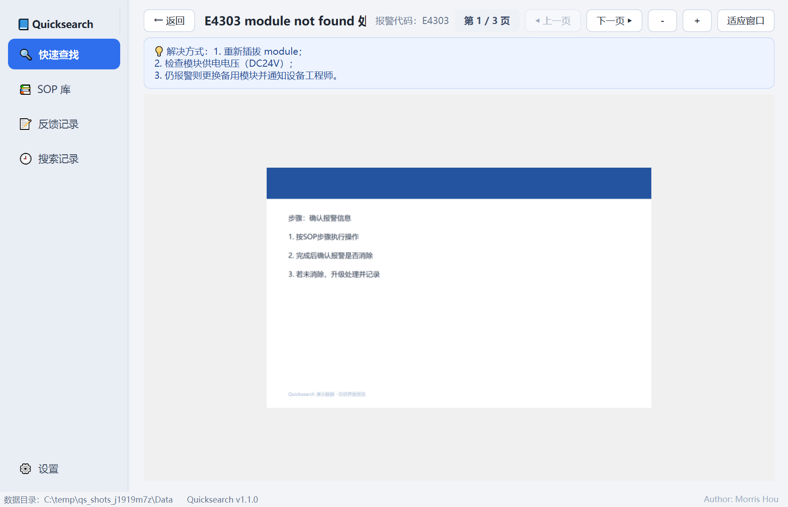
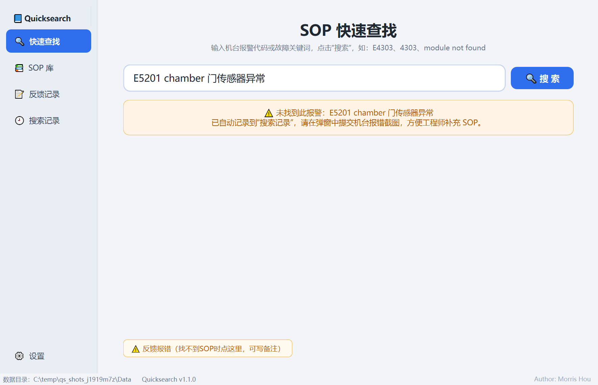
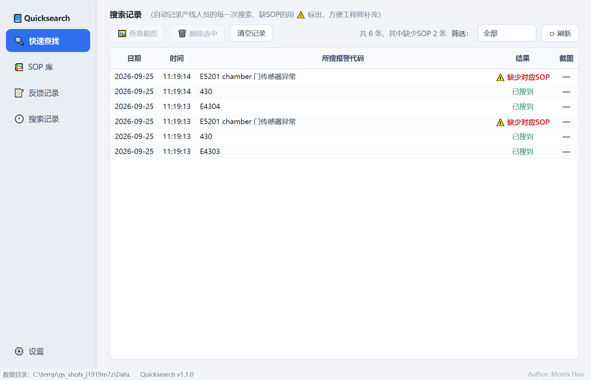

# Quicksearch — 机台报警 SOP 快速查找

供半导体产线人员快速查找机台报警对应的处理 SOP，并由工程师维护 SOP 库、跟进反馈记录。
单文件 exe、免安装、无任何外部依赖，全面支持中文路径 / 中文文件名 / 中文界面。


## 界面预览

| 快速查找（多结果选择） | SOP 查看器（滚轮缩放/拖拽） |
| --- | --- |
|  |  |

| 未找到→提交报错截图 | 搜索记录（⚠ 缺少对应SOP） |
| --- | --- |
|  |  |

---

## 一、快速上手（产线人员）

1. 双击 `Quicksearch.exe` 打开软件。
2. 在首页搜索框输入**报警代码或故障关键词**：
   - **输入时自动弹出联想下拉**（像浏览器地址栏）：↑/↓ 选择、回车直接打开、Esc 收起、单击条目直接打开；
   - 点右侧 **"🔍 搜索"**（或输入框回车）执行正式搜索：`E4303`、`4303`、`module not found`、`风扇` 都能模糊命中。
3. 搜索结果：
   - **唯一命中** → 直接打开 SOP 查看页。查看时**滚轮直接缩放**（以鼠标位置为中心）、
     **按住左键拖动**平移画面、←/→ 翻页、"适应窗口"复位；点"← 返回"回到搜索页；
   - **多个命中**（模糊搜索，如 `E40` 命中 E401、E402）→ 弹出列表，**单击选择**要看的 SOP；
   - **未找到** → 自动记录，并**弹出提交窗口**："此报错暂无对应SOP，请提交机台报错截图"。
     三种方式任选：按 **Ctrl+V** 粘贴截图（PrintScreen/聊天工具截图）、点"📋 粘贴截图"、
     或点"📁 选择照片…"从电脑文件夹里选一张照片；点"提交"即可，也可选"暂不提交截图"。
4. 每次点"搜索"都会自动写入**搜索记录**（日期、时间、所搜内容、是否找到、有无截图）。
5. 需要补充文字说明时点 **"⚠ 反馈报错"** 写备注提交，工程师在"反馈记录"里跟进。

快捷键：`Ctrl+F` 跳回搜索框；`Esc` 从查看页返回。

## 二、工程师操作

### SOP 库（第二个模块）
- **新建 SOP**：填名称、关联报警代码（可多个，如 E4303、E4305 共用一个 SOP）、解决方式说明；
  页面支持"添加图片"（png/jpg/bmp 等，自动按文件名自然排序）或"添加PPT"。
- **添加PPT**：后台自动调用本机 PowerPoint/WPS 把每页转成 PNG（仅上传电脑需要装 Office，
  产线电脑不需要）。转换同时保留一份 PPT 原文件，查看时可一键用系统程序打开。
  - PPT 可多次追加；页面支持上移/下移/移除。
  - 转换失败（没装 Office）时提示改用"添加图片"。
- **编辑 / 删除**：选中列表中的 SOP 后操作；删除会同时清理页面文件（有确认提示）。
- **排序**：按修改时间（新→旧 / 旧→新）或按名称（A→Z / Z→A，数字按自然序）。
- **筛选**：输入关键词即时过滤名称/代码/解决方式。
- **双击行**：直接打开查看。

### 反馈记录（第三个模块）
- 查看产线提交的反馈：反馈时间、报警内容、备注。
- 新反馈默认 **待补充**（橙色）；处理完后选中点 **"✔ 标记已解决"**（变绿色，记录解决时间）；
  点错可 **"↩ 恢复待补充"**。
- **双击行**或点"✎ 编辑备注"补充处理备注；支持按状态筛选、删除误提交的记录。

### 搜索记录（第四个模块）
- **自动记录**产线人员的每一次搜索：`日期 | 时间 | 所搜报警代码 | 结果 | 截图`。
- 结果列：找到显示绿色 **"已搜到"**；没找到显示红色 **"⚠ 缺少对应SOP"**（带三角警示符）。
- 产线人员提交的机台报错截图显示 **"📎 有截图"**：选中后点 **"🖼 查看截图"**（或双击行）放大查看，
  查看窗里点 **"💾 另存为…"** 可把截图保存到指定位置（默认桌面，可选 PNG/JPG 格式）；
  筛选支持 全部 / 仅缺少SOP / 有截图。
- 支持删除选中、清空记录（有确认）；记录最多保留 10000 条，超出自动丢弃最旧的。

### 高清修复（独立小工具：SOP高清修复工具.exe）
- 与主程序**分开打包**：`SOP高清修复工具.exe` 只在**工程师电脑**上使用，产线电脑不需要装。
- 打开后自动定位数据目录（可手动更改，支持共享路径）→ 列表选择 SOP → 点"✨ 开始修复"：
  用开源 FSRCNN 超分模型（GitHub: Saafke/FSRCNN_Tensorflow，经 OpenCV dnn_superres 推理）
  把每页图片放大 2 倍并轻锐化，约 1 秒/页，带进度条。
- 修复是**替换原图**的一次性操作，动手前建议先复制一份 Data 文件夹备份。
- 主程序不含 OpenCV，保持轻量（约 47MB）；工具约 108MB。

## 三、部署

### 单机使用（默认）
把 `Quicksearch.exe` 拷到任意**可写**目录（如 D:\Quicksearch\）运行即可。
数据自动存放在 exe 旁边的 `Data\` 文件夹，**备份/迁移 = 拷走整个文件夹**：

```
Quicksearch.exe
Data\
  sops.json        SOP 索引（元数据，很小）
  feedback.json    反馈记录
  searchlog.json   搜索记录（自动记录，上限10000条）
  media\<id>\      SOP 页面图片（按需加载）
```

### 多台电脑共用一套 SOP 库（局域网共享）
1. 在服务器/共用电脑上建一个共享文件夹，如 `\\服务器\share\QuicksearchData`。
2. 每台电脑打开软件 → **⚙ 设置 → 数据目录 → 更改**，指向该共享路径，保存。
3. 工程师在其中一台电脑维护 SOP，所有产线电脑立即可查（查看时点"⟳ 刷新"可见最新）。

> 建议：SOP 的编辑维护固定由一名工程师在一台电脑上进行，避免多人同时改同一条。

### 只读安装位置的处理
若 exe 放在不可写目录（如 C:\Program Files），数据自动改存到
`%LOCALAPPDATA%\Quicksearch\Data`，可在设置里看到实际路径。

## 四、性能说明（弱配产线电脑优化）

- 启动只读两个小 JSON 索引，不加载任何图片；高清修复组件（OpenCV）是懒加载，
  日常查看路径完全不碰它。
- 搜索纯内存计算：**3000 条 SOP 实测 8 毫秒**；SOP 库整表 3000 行填充 0.06 秒
  （批量重绘），首页搜索+记录 40 毫秒。数据再多也不卡。
- 查看器同一时间只解码**当前一页**（超大图自动降到 4K 内），翻页即释放，内存占用恒定；
  缩放过程用快速插值跟手、停手 0.2 秒后自动换精细渲染。
- 三个列表页（SOP库/反馈/搜索记录）批量填充，几千行只重绘一次。
- 无后台轮询、无联网；输入 120ms 防抖；单实例运行。
- 主程序 exe 约 47MB、单文件解压启动约 2 秒；高清修复功能在独立小工具中，
  不占主程序体积。

## 五、自检与维护

```bat
Quicksearch.exe --selftest    运行 9 项自检（搜索/存取/图标/界面冒烟等），
                              结果同时写入当前目录 selftest_report.txt
Quicksearch.exe --ppt-test    PPT→图片端到端转换测试（需本机有 PowerPoint/WPS）
Quicksearch.exe --smoke       启动 2 秒自动退出（部署后快速验证）
Quicksearch.exe --data-dir X  临时指定数据目录
```

### 重新打包（源码更新后）
1. 装有 Python 3.10+ 的电脑上
   `pip install PySide6 pywin32 pyinstaller pillow opencv-contrib-python`。
2. 双击 `build.bat`，产物为 `dist\Quicksearch.exe`（主程序）和
   `dist\SOP高清修复工具.exe`（独立修复工具）。
3. 发给产线替换旧 exe 即可（Data 文件夹不受影响）。

### 代码结构（方便后续修改）
```
main.py               入口（命令行参数 / 单实例 / 样式）
app\config.py         路径与配置（数据目录解析规则）
app\store.py          数据模型 + JSON 原子读写（兼容共享盘）
app\search.py         模糊搜索引擎（打分排序规则在这改）
app\converter.py      PPT→PNG（PowerPoint/WPS COM，ProGID 顺序可加）
app\enhance.py        高清修复（FSRCNN 超分 + 锐化，懒加载 OpenCV）
app\icons.py          图标绘制（书本+放大镜，改样式在这改）
app\selftest.py       自检测试（含 3000 条规模性能测试）
app\ui\               界面：main_window / search_page / viewer_page /
                      library_page / editor_dialog / feedback_page /
                      searchlog_page / settings_dialog
app\ui\theme.py       配色与样式（QSS 集中管理）
tools\make_icon.py    生成 ico；tools\take_screens.py 界面截图预览
```

## 六、常见问题

| 现象 | 说明 / 处理 |
| --- | --- |
| 双击 exe 没反应 | 等几秒（单文件首次解压）；仍无反应则运行 `--smoke` 看退出码，并把杀毒软件误报加入白名单 |
| 杀毒软件报毒 | 未签名 PyInstaller 程序的常见误报，加入信任区即可 |
| PPT 转换失败 | 上传电脑需装 PowerPoint 或 WPS；或把 PPT 每页导出为图片后"添加图片"导入 |
| 共享目录保存失败 | 检查网络与共享写权限；软件会自动重试，多人同时保存时稍后再试 |
| 数据会丢吗 | 每次保存都是"先写临时文件再原子替换"，断电也不会写坏索引；即使索引损坏也会自动备份坏文件并重建。重要数据建议定期"设置→备份数据" |

## 七、从源码构建

```bat
git clone https://github.com/THcode666/Quicksearch.git
cd Quicksearch
pip install PySide6 pywin32 pyinstaller pillow opencv-contrib-python
build.bat        rem 自动生成图标、下载超分模型、打包两个 exe 到 dist\
```

自测：`python main.py --selftest`（11 项，含 3000 条 SOP 规模性能测试）。

## 八、致谢

- [FSRCNN_Tensorflow](https://github.com/Saafke/FSRCNN_Tensorflow) — 高清修复所用 FSRCNN x2 超分模型（打包前由 `tools/download_model.py` 自动下载，仓库不直接附带模型文件）
- [OpenCV dnn_superres](https://docs.opencv.org/4.x/d1/dc0/tutorial_dnn_superres.html) — 超分推理
- [PySide6（Qt6）](https://www.qt.io/)、[PyInstaller](https://pyinstaller.org/) — 界面与打包

## 许可

本项目代码以 [MIT License](LICENSE) 发布。超分模型版权归其上游项目所有，使用时请遵循其许可。

## 作者

**Morris Hou**（[THcode666](https://github.com/THcode666)）

> 为半导体晶圆测试产线做的内部工具，开源出来供同行业参考。数据全部保存在本地/局域网，不联网、不上传。
